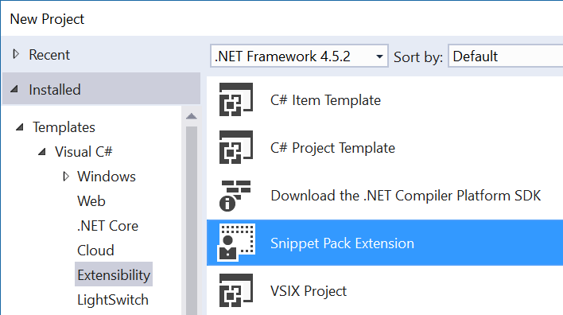
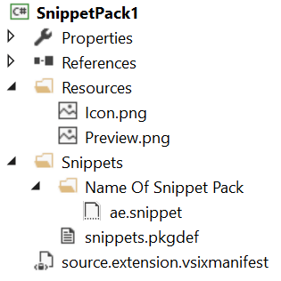

# SnippetPackTemplate

<!-- Replace this badge with your own-->

<!-- Update the VS Gallery link after you upload the VSIX-->
Download this extension from the [VS Gallery](https://visualstudiogallery.msdn.microsoft.com/[GuidFromGallery])
or get the [CI build](http://vsixgallery.com/extension/800367d9-3754-49c6-a863-1fe65be05d32/).

---------------------------------------

A snippet pack for Visual Studio

See the [change log](CHANGELOG.md) for changes and road map.

## Features

- Create snippet pack extensions
- Works with all supported languages like C#, VB, JavaScript, HTML etc.

## How to use
Create a new project and select the **Snippet Pack Extension**.

That will create a VSIX project with the following structure:

Instructions will automatically show up on how to modify the snippets
to your scenario.

### Changing language
Snippets are per language, and this snippet pack is targeting JavaScript
by default. It is easy to change so you can target any other language
supporting snippets. 

To do that, open *Snippets/snippets.pkgdef* and follow the instructions
found at the top of that file.

### Changing name
The *Snippets* folder contains a folder which has the name of your
extension. You can name this folder whatever you want as long as you
also change the name in *snippets.pkgdef* accordingly.

### .snippet files
The .snippet must have a few properties set correctly for this to work.

Select one or more .snippet files and hit F4 to bring up the property
grid. Set the following properties:

- **Build action** : *Content*
- **Include in VSIX**: *True*

Read more about the possibilities with code snippets on
[MSDN](https://msdn.microsoft.com/en-us/library/ms165392.aspx)

## Contribute
Check out the [contribution guidelines](CONTRIBUTING.md)
if you want to contribute to this project.

For cloning and building this project yourself, make sure
to install the
[Extensibility Tools 2015](https://visualstudiogallery.msdn.microsoft.com/ab39a092-1343-46e2-b0f1-6a3f91155aa6)
extension for Visual Studio which enables some features
used by this project.

## License
[Apache 2.0](LICENSE)